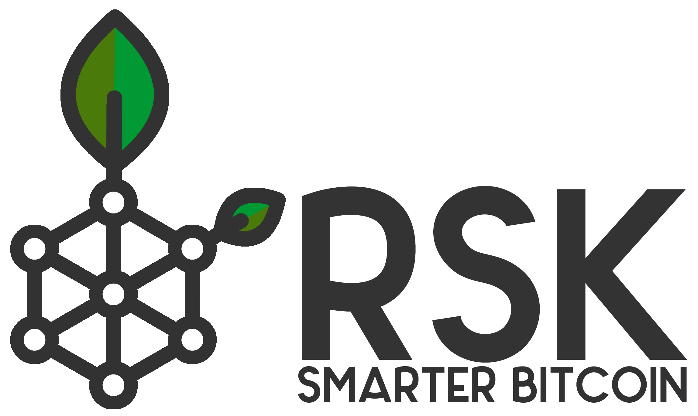
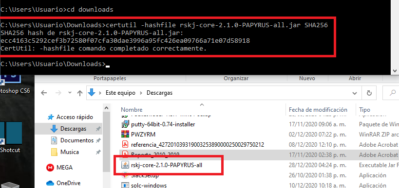
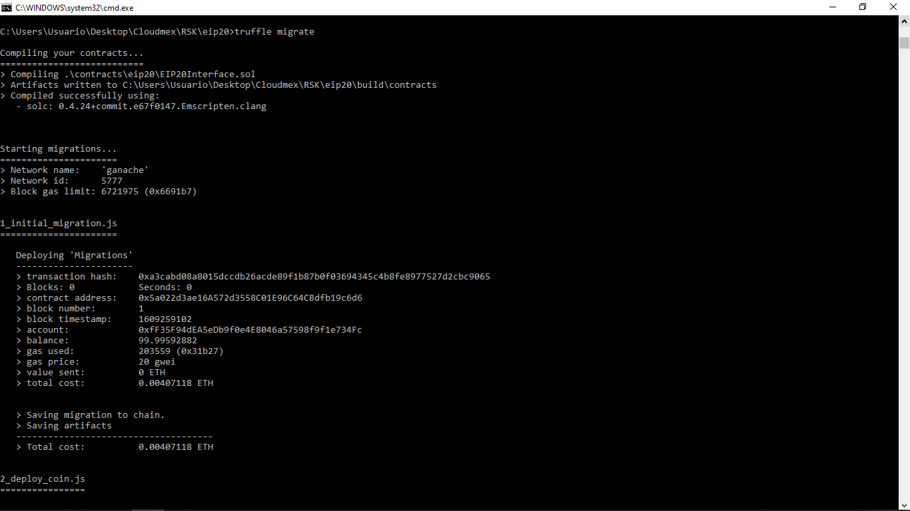
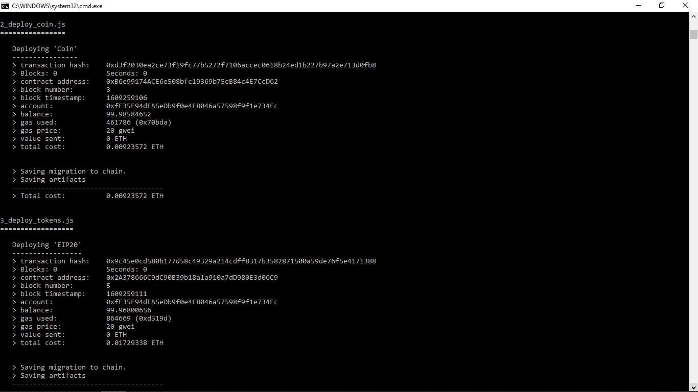

# SMART CONTRACTS #Truffle #RSK #Ganache

Practica de creacion de Smart Contract implementando RSK. 

Primero instalaremos RSK por lo que descargaremos el archivo del siguiente enlace: https://github.com/rsksmart/rskj/releases/download/PAPYRUS-2.1.0/rskj-core-2.1.0-PAPYRUS-all.jar (para el caso de Windows), una vez descargado en cmd ubicamos la carpeta donde esta nuestro archivo y ejecutamos el siguiente comando "certutil -hashfile rskj-core-2.1.0-PAPYRUS-all.jar SHA256"

Despues creamos la carpeta de neustro proyecto e instalaremos truffle usando:

npm install truffle
npm init
npm install @openzeppelin/contracts
npm install truffle-privatekey-provider

Y para finalizar las instalaciones debemos contar con Ganache instalado:

https://www.trufflesuite.com/ganache

Para ello clonamos el repositorio y lo compilamos, una vez compilado mantenemos nuestro Ganache activado y relizaremos la migracion usando el comando truffle migrate

Y veremos que funciona correctamente al observar como descuenta la cantidad correspondiente a nuestra primer cuenta en la lista de Ganache.

Tutorial original : https://developers.rsk.co/quick-start/step1-install-rsk-local-node/